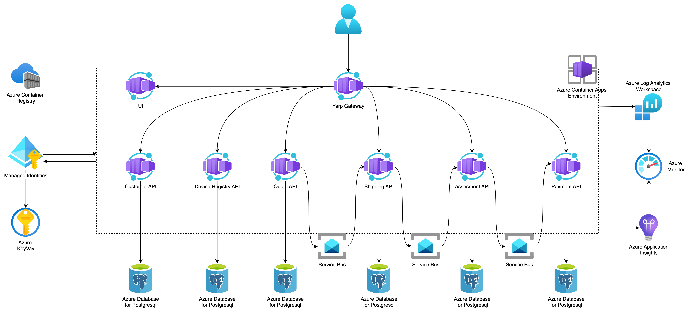

# Going Green Project


**Going Green** is an example .NET microservices solution showcasing a well-architected microservice architecture with Azure Container Apps deployment. The idea is inspired by Neal Ford’s Going Green architecture kata ([https://nealford.com/katas/kata?id=GoingGreen](https://nealford.com/katas/kata?id=GoingGreen)), this project demonstrates best practices with .NET 9 and .NET Aspire, design of Microservices, Infrastructure as a Code and Cloud Arhitectures. Still a work in progress.

## Table of Contents

- [About](#about)
- [Architecture](#architecture)
- [Features](#features)
- [Technologies](#technologies)
- [Prerequisites](#prerequisites)
- [Getting Started](#getting-started)
- [Infrastructure](#infrastructure)
- [Contributing](#contributing)
- [License](#license)

## About

Going Green demonstrates how to build, deploy, and manage containerized microservices on Azure Container Apps, following Microsoft’s Well-Architected Framework.

## Architecture

Below is the high-level architecture diagram for the solution:



## Features

- **Containerized Microservices**: Developed in C#/.NET 9
- **Serverless Containers**: Deployed on Azure Container Apps
- **Infrastructure as Code**: Managed with Terraform
- **CI/CD Pipelines**: Automated via GitHub Actions
- **Monitoring & Logging**: Integrated with Azure Monitor and Log Analytics

## Technologies

- [.NET 9 SDK](https://dotnet.microsoft.com/)
- [.NET Aspire](https://github.com/dotnet-architecture/aspire)
- [Azure Container Apps](https://azure.microsoft.com/en-us/services/container-apps/)
- [Terraform](https://www.terraform.io/)
- [GitHub Actions](https://github.com/features/actions)
- [Azure CLI](https://docs.microsoft.com/cli/azure/)

## Prerequisites

- [.NET 9 SDK](https://dotnet.microsoft.com/download)
- [.NET Aspire tools](https://github.com/dotnet-architecture/aspire)
- [Azure CLI](https://docs.microsoft.com/cli/azure/install-azure-cli)
- [Terraform](https://www.terraform.io/downloads.html)
- Git

## Getting Started

1. **Clone the repository**

   ```bash
   git clone https://github.com/makigjuro/going-green.git
   cd going-green

2. **Authenticate to Azure**

   ```bash
   az login

3. **Initialize Terraform**
   
   ```bash
   cd infra/terraform
   terraform init

4. **Review and apply infrastructure**   
   ```bash
    terraform plan
    terraform apply

4. **Build and Deploy Services**   

The GitHub Actions pipeline will automatically build Docker images and deploy to Azure Container Apps on push to main.

## Infrastructure

Terraform code is located in the infra/terraform folder. It defines:

- Azure Resource Group

- Container Apps Environment

- Log Analytics Workspace

- Managed Identities and Networking

- Azure KeyVault

- Postgresql Databases Server

- Azure Service Bus


## Contributing
Contributions are welcome! Please open an issue or submit a pull request.

## License
This project is licensed under the MIT License - see the LICENSE file for details.


